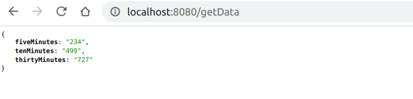
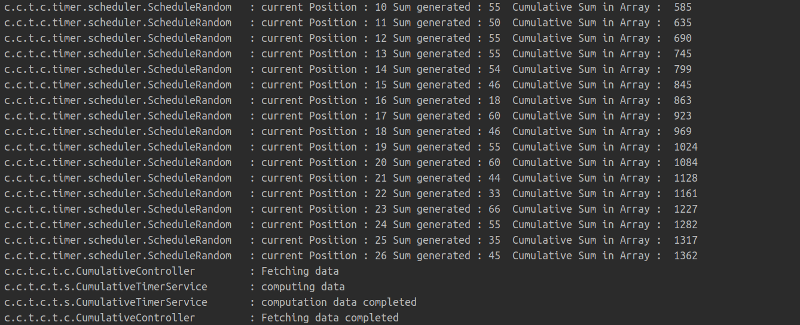

<h1 align="center">Cumulative Timer</h1>

<!-- TABLE OF CONTENTS -->
## Table of Contents

* [About the Project](#about-the-project)
  * [Built With](#built-with)
* [Getting Started](#getting-started)
* [Explantion](#Explanation)

<!-- ABOUT THE PROJECT -->
## About The Project

Application computes sum of 5 random numbers every second.
At any instant of time, it will return the sum of numbers generated in last 5,10 and 30 minutes.

### Built With
* [Spring Boot](https://spring.io/projects/spring-boot)

<!-- GETTING STARTED -->
## Getting Started

1. Clone this repo and setup it on your IDE.
2. Run the application and access http://localhost:8080/getData to get response.

## Explanation
1. Application contains time storage array of size 1801, which stores the data generated by scheduler in circular format.
2. The size is set to 1801 because we are only interested in getting data of last 30 minutes(30 * 60).
3. A scheduler is setup which generates 5 random numbers every second and stores cumulative sum in Array.
4. To get data at any instant, application calculates difference in the value of current pointer and previous pointer.

Consider below example where array size is set as 16, and we want data for 5, 10 and 15 seconds.

We can verify the output from below logs.
For example:
cumulative Sum at 26th second is 1362.
cumulative Sum at 21 second is 1128.
Difference between them is shown as output in above image for 5 seconds.
Similarly we can calculate for 10 and 15 seconds.

This is just a sample output for the sake of explantion.
Original array size is 1801 and application calculates time difference for 5,10 and 30 minutes.

